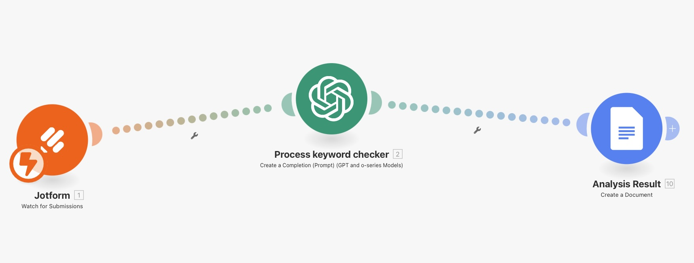
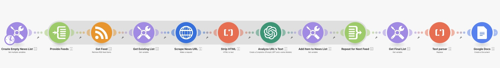

Project Manager | Data Analyst | Python Enthusiast

## Data Analytics Projects
### Data Jobs Market Analysis Project
This [project](https://github.com/furtadorebeca/3_RF_Project) was the result of taking the **Python for Data Analytics** created by [Luke Barousse](https://www.linkedin.com/in/luke-b) and [Kelly Adams](https://www.linkedin.com/in/kellyjianadams). The objective is to navigate and understand the job market for data positions more effectively. It delves into the top-paying and in-demand skills to help find optimal job opportunities for data analysts.

The data was sourced from [Luke Barousse's Python Course](https://lukebarousse.com/python), which provides a foundation for my analysis, containing detailed information on job titles, salaries, locations, and essential skills. Through a series of Python scripts, I explore key questions such as the most demanded skills, salary trends, and the intersection of demand and salary in data analytics.
 
 

## Project Management
I remember well when I decided I wanted to become a PM, Inspired by a couple of project managers at IBM, who graciously took time from their busy schedules to give me advice about the profession. Since that day, these are my major milestones:
- Found a mentor; one of these professionals who love what they do, and feel joy in sharing what they know.
- Attended a one-year certificate in Project Management at the University of Toronto - SCS.
- First important assignment, a client initiative, as an associate project manager.
- First official position as a project manager, where I learned a lot from my expert peers.
- Led an enterprise two-year complex project.
- Managed over 40 projects (small-medium-large), many of them concurrently. 
- **PMP®**: prepared for a few months, and on December 2, 2024, I wrote and passed the PMI's Project Management Professional (PMP®) exam on my first try! **AT/AT/AT** _If you want to see how I did it, stay tuned. I'll share it here_ ;)
- **CSM®**: Prepared for the Certified Scrum Master (CSM®) exam. _The preparation for the PMP exam, which 50% of the questions are about Agile and Hybrid methodologies, gave me a solid foundation to prepare for this exam. On January 19, 2025, I wrote and passed the CSM®.
- Skill Stacking: during this time between my last job and my new one, I'm intentionly combining multiple complimentary skills to create my unique edge.
 

## Workflows
In April 2025, I took one of the most useful courses in the productivity realm: **Practical Application of Generative AI for Project Managers**, offered for free to PMI members. Among many cool things, I had a chance to experiment and create amazing workflows.  
These are screenshots of 2 workflows I created: a word analyzer and a news feed analyzer. These workflows were created in Make.com, and the key components are ChatGPT and Google Docs.

### Word Analyzer
The word analyzer gets the information entered in a JotForm form: job posting information and candidate resume. It gets this information analyzed by ChatGPT using pre-determined keywords.  
The result is a feedback on how well aligned the two are and offers suggestions to improve the resume.  
The output is sent to a Google Docs file.

### Feed News Analyzer
The feed analyzer collects new information from pre-determined sources, parses it to HTML, and gets it analyzed by ChatGP.  
The output is sent to a Google Docs file.

 
 
  
## Templates
_(Coming soon)_

